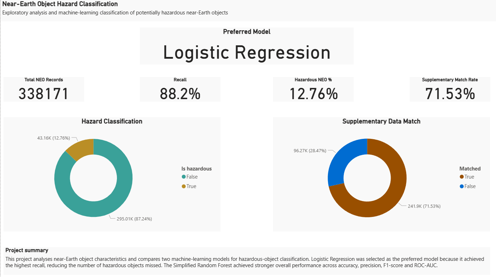
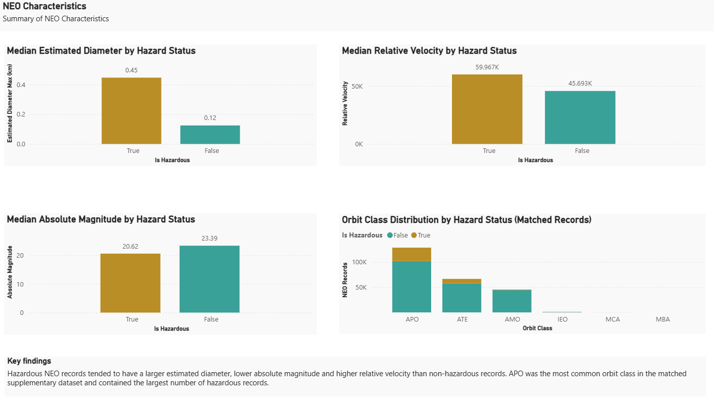
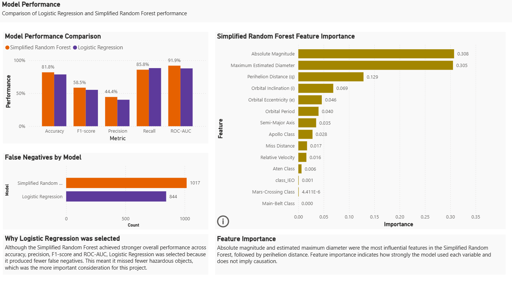
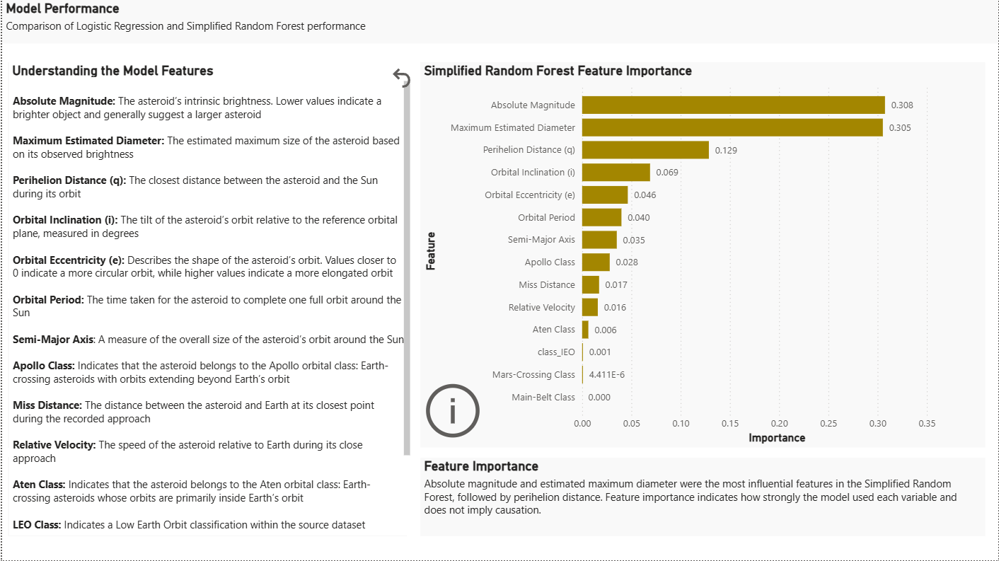

# Near-Earth Object Hazard Classification

## Executive Summary

This project compares **Logistic Regression** and a **Simplified Random Forest** for classifying potentially hazardous near-Earth objects using physical and orbital characteristics.

### Key findings:

- The cleaned primary dataset contained **338,171 NEO records**.
- Only **12.76%** of records were classified as hazardous, creating a clear class imbalance.
- **241,900 records (71.53%)** matched to supplementary orbital data.
- Logistic Regression achieved the highest **recall at 88.2%**, missing **844 hazardous objects**.
- The Simplified Random Forest achieved stronger overall accuracy, precision, F1-score and ROC-AUC, but had slightly lower recall at **85.8%** and missed **1,017 hazardous objects**.
- Logistic Regression was selected as the preferred model because reducing false negatives was treated as the highest priority.
- The initial Random Forest substantially overfit the training data, so model complexity was constrained to improve generalisation.

The final outputs include: four reproducible Jupyter notebooks, model performance exports and a three-page Power BI dashboard.

## Project Overview

This project investigates whether near-Earth objects (**NEO**s) can be classified as potentially hazardous using their physical and orbital characteristics.

The analysis combines a large primary NEO dataset with supplementary orbital information, explores differences between hazardous and non-hazardous objects, and compares two machine-learning approaches: **Logistic Regression** and a **Simplified Random Forest**.

The final model recommendation prioritises **recall**, because failing to identify a hazardous object was treated as a more serious error than incorrectly flagging a non-hazardous object.

## Project Question

Can Logistic Regression and Random Forest models **classify potentially hazardous near-Earth objects** using their physical and orbital characteristics, and **which approach is most suitable** when minimising missed hazardous objects is the priority?

## Tools Used

- Python
- pandas
- matplotlib
- scikit-learn
- Jupyter Notebook
- Power BI
- GitHub

## Data Sources

Two datasets were used in this project:

- A primary near-Earth object dataset containing physical characteristics such as absolute magnitude, estimated diameter, relative velocity, miss distance and the hazardous classification.
- A supplementary dataset containing orbital characteristics including eccentricity, semi-major axis, perihelion distance, orbital inclination, orbital period and orbit class.

The datasets were linked using the NEO identifier. Of the **338,171** cleaned primary records, **241,900** matched to the supplementary dataset, giving a match rate of **71.53%**.

The unmatched records were investigated rather than automatically discarded. Their hazardous-object rate differed from the matched records, indicating that removing them through an inner join could introduce selection bias. A **left join** was therefore used to retain all primary records while adding orbital information where available.

## Data Engineering & Quality

The primary dataset was cleaned by checking for missing values and duplicate records. Only **28** rows contained missing values in key physical characteristics, so these were removed, leaving **338,171 records** for analysis.

Data quality was considered using the **UK Government Data Quality Framework**, with particular attention to completeness, uniqueness, validity and consistency.

- **Completeness:** missing values and supplementary-data coverage were assessed.
- **Uniqueness:** duplicate records and identifier uniqueness were checked before joining.
- **Validity:** data types and numerical distributions were reviewed to identify unexpected values.
- **Consistency:** identifier matching and row counts before and after the join were checked to ensure the integration process did not remove or multiply primary records.

The supplementary dataset was joined to the primary dataset using a **left join**. This preserved all cleaned primary NEO records while adding orbital information where a match was available.

**Accuracy** could not be independently verified from the supplied datasets alone, while **timeliness** was less important because the project focused on historical NEO observations.

## Exploratory Data Analysis

Exploratory data analysis was used to understand the structure of the data, identify class imbalance and compare the characteristics of hazardous and non-hazardous NEOs.

Only **12.76%** of records were classified as **hazardous**, showing a clear class imbalance. This made accuracy alone unsuitable as the main evaluation metric and supported the decision to prioritise **recall**, because false negatives represent hazardous objects that the model fails to identify.

Median values were used when comparing several numerical characteristics because the data contained skewed distributions and extreme values.

**Key patterns** included:

- Hazardous NEOs had a larger median estimated maximum diameter.
- Hazardous NEOs had a lower median absolute magnitude, meaning they tended to be brighter.
- Hazardous NEOs had a higher median relative velocity.
- Differences in median miss distance were comparatively small.
- Among matched supplementary records, hazardous objects showed different orbital characteristics, including higher median eccentricity and lower median perihelion distance.
- APO was the most common orbit class and contained the largest number of hazardous records.

Correlation analysis also identified very strong correlation between minimum and maximum estimated diameter, so only **estimated maximum diameter** was retained for modelling to reduce redundant information.

## Machine Learning Approach

Two classification models were compared:

- **Logistic Regression** was used as a baseline because it provides a relatively simple and interpretable classification approach.
- **Random Forest** was used as a more flexible non-linear model capable of capturing more complex relationships between NEO characteristics and hazardous status.

Because multiple observations could relate to the same NEO, the data was split using a **grouped train-test split based on `neo_id`**. This prevented the same asteroid identifier from appearing in both the training and test sets and reduced the risk of data leakage.

The hazardous class was substantially smaller than the non-hazardous class, so both models used **class weighting** to give greater importance to hazardous records during training.

The initial Random Forest achieved a training recall of **1.000** but only **0.500** recall on the test set, indicating substantial overfitting. To improve generalisation, the model was simplified by constraining tree depth and increasing the minimum number of samples required to split nodes and create leaves.

The resulting **Simplified Random Forest** achieved a test recall of **0.858**, while also improving accuracy, precision, F1-score and ROC-AUC compared with Logistic Regression.

However, **Logistic Regression** achieved the highest recall at **0.882**, so it remained the preferred model where minimising missed hazardous objects was the main priority.

## Model Results

| Metric | Logistic Regression | Simplified Random Forest |
|---|---:|---:|
| Accuracy | 78.6% | 81.8% |
| Precision | 40.2% | 44.4% |
| Recall | **88.2%** | 85.8% |
| F1-score | 55.2% | 58.5% |
| ROC-AUC | 87.8% | **91.9%** |

Although the Simplified Random Forest achieved stronger performance across most metrics, Logistic Regression produced the highest recall.

This was important because the project treated **false negatives as the most serious error**. Logistic Regression missed **844 hazardous objects**, compared with **1,017** for the Simplified Random Forest.

For that reason, **Logistic Regression was selected as the preferred model** for this project.

## Power BI Dashboard

A three-page Power BI dashboard was created to communicate the main findings from the analysis and modelling process.

### Project Overview

This page summarises the dataset, hazardous-object proportion, supplementary-data match rate and the selected model.

### NEO Characteristics

This page compares physical and orbital characteristics between hazardous and non-hazardous NEOs.

### Model Performance

This page compares Logistic Regression and the Simplified Random Forest, including model metrics, false negatives and Random Forest feature importance. A bookmark has been used to guide non-technical/non-familiar users in understanding the terminology used in the Feature Importance visual. The user can click the information icon in the bottom left corner of the chart to open a helpful note which provides concise explanations of the terms used, and close it when desired.

